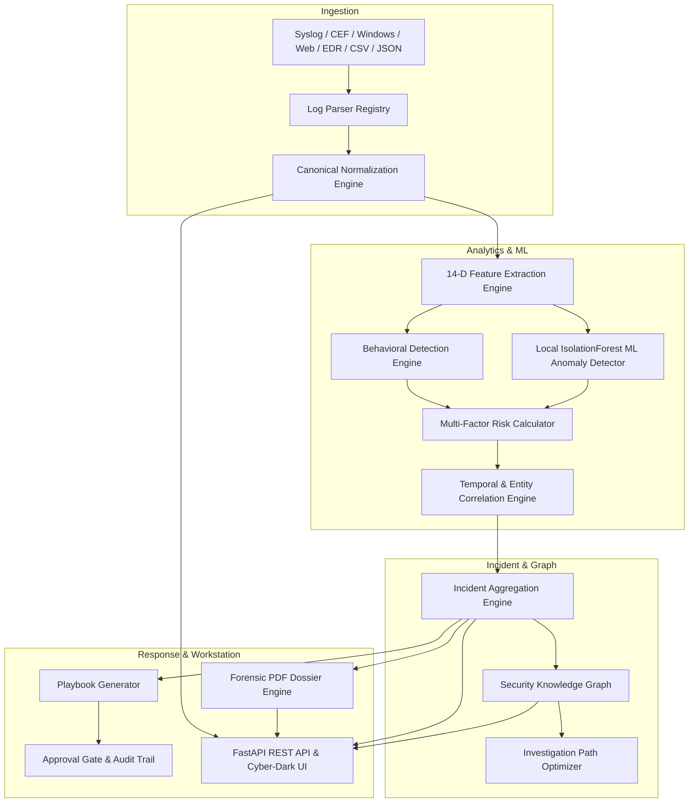

# SentinelAI — AI-Powered Autonomous SOC Assistant

[](https://www.python.org/)
[](https://fastapi.tiangolo.com/)
[](https://react.dev/)
[](https://www.sqlite.org/)
[](https://scikit-learn.org/)
[](https://www.reportlab.com/)
[](LICENSE)

**SentinelAI** is an enterprise-grade, autonomous Security Operations Center (SOC) platform engineered with a strict **100% Local, Zero-Cloud-Dependency Architecture**. It requires **zero external API keys** (no OpenAI, no Anthropic, no Google Cloud), ensuring total data sovereignty and privacy.

---

## Key Capabilities & Highlights

1. **Multi-Format Ingestion Subsystem**: Ingests and parses Syslog (RFC 3164/5424), ArcSight CEF, Windows Event Logs (XML), Web Server Combined Logs, Palo Alto/Fortinet Firewalls, CrowdStrike/Defender EDR, CSV, and JSON telemetry into a unified canonical schema.
2. **10-Category Detection Engine**: Real-time evaluation of Brute Force, Port Scans, Privilege Escalation, Data Exfiltration, Malware C2 Beacons, SQL Injection, Lateral Movement, Anomalous Access, Ransomware indicators, and Defense Evasion.
3. **Local Machine Learning with Explainability**: In-memory and persisted `IsolationForest` anomaly detector with real-time SHAP-proxy feature attribution for transparent risk explanations.
4. **Knowledge Graph & Path Optimizer**: Security knowledge graph modeling entities, IPs, users, hosts, and alerts with an A*/heuristic priority-queue investigation path optimizer.
5. **Human-in-the-Loop Response Playbooks**: 4-phase incident mitigation playbooks with explicit approval gates, role-based access control, and complete immutable audit logging.
6. **Forensic PDF Dossier Generator**: Native ReportLab engine generating multi-page, formatted Incident Forensic Dossiers and Executive SOC Summaries on demand.
7. **Zero-Node Cyber-Dark Glassmorphic UI**: High-performance Cyber-Dark React 18 workstation served directly by FastAPI at `http://127.0.0.1:8000/`.

---

## System Architecture



---

## Quick Start Guide

### 1. Prerequisites
- Python 3.12+ installed on Windows, Linux, or macOS.
- PowerShell or standard Bash terminal.

### 2. Setup Environment & Install Dependencies
```bash
# Clone the repository
git clone https://github.com/your-org/sentinelai.git
cd sentinelai

# Create and activate virtual environment
python -m venv .venv
# On Windows PowerShell:
.\.venv\Scripts\Activate.ps1
# On Linux/macOS:
# source .venv/bin/activate

# Install all backend requirements
pip install -r requirements.txt
```

### 3. Initialize Database & Train Models
```bash
# Create SQLite WAL database & seed default rules/indicators/admin
python scripts/init_db.py

# Generate 5,000 synthetic multi-scenario security events
python scripts/generate_dataset.py

# Train local IsolationForest anomaly detection model
python scripts/train_models.py
```

### 4. Launch SentinelAI SOC Assistant
```bash
python -m uvicorn backend.app.main:app --host 127.0.0.1 --port 8000 --reload
```

- **SOC Web Console**: Open [http://127.0.0.1:8000/](http://127.0.0.1:8000/)
- **Interactive Swagger API Docs**: Open [http://127.0.0.1:8000/docs](http://127.0.0.1:8000/docs)
- **Default Admin Credentials**:
  - **Email**: `admin@sentinelai.local`
  - **Password**: `SentinelDemo!2026`

---

## Verification & Testing

Execute the automated test suite and project metrics audit:

```bash
# Run all unit and integration tests
python -m pytest tests/ -v

# Run the comprehensive code & architecture audit
python scripts/project_audit.py
```

---

## Project Structure

```
sentinelai/
├── backend/
│   └── app/
│       ├── api/v1/          # 18 Modular REST API Controllers
│       ├── core/            # Config, SQLite WAL Database, Logging
│       ├── engines/         # Ingestion, Feature, Detection, Correlation, Risk
│       ├── graph/           # Security Knowledge Graph Topology
│       ├── ml/              # Scikit-learn IsolationForest & Playbook Engine
│       ├── models/          # 30+ SQLAlchemy Domain Models
│       ├── optimization/    # Heuristic Investigation Optimizer
│       ├── parsers/         # Multi-format Log Parsers & Registry
│       ├── repositories/    # Repository Data Access Pattern
│       ├── schemas/         # Pydantic v2 Serialization Schemas
│       ├── security/        # Argon2 Hashing, JWT, RBAC Roles
│       ├── services/        # ReportLab PDF Generation, Audit Logs
│       └── static/          # Embedded Cyber-Dark React Workstation
├── frontend/                # React 18 TypeScript Source Code
│   └── src/
│       ├── components/      # Navigation, Modals, Playbook, Log Uploaders
│       ├── pages/           # Dashboard, Events, Incidents, Graph, Rules, Approvals
│       ├── services/        # Axios API Client & Authentication
│       └── types/           # TypeScript Domain Interfaces
├── datasets/                # Generated & Sample Telemetry Data
├── docs/                    # Architecture, API, ML, and SOC Manuals
├── scripts/                 # Database Init, Dataset Generator, ML Trainer
└── tests/                   # Pytest Unit & Integration Test Suite
```

---

## Security & Ethics Statement
SentinelAI is strictly designed for defensive threat detection, security operations, and autonomous incident response. All simulated scenarios and telemetry generation run locally within sandboxed development or staging environments.
