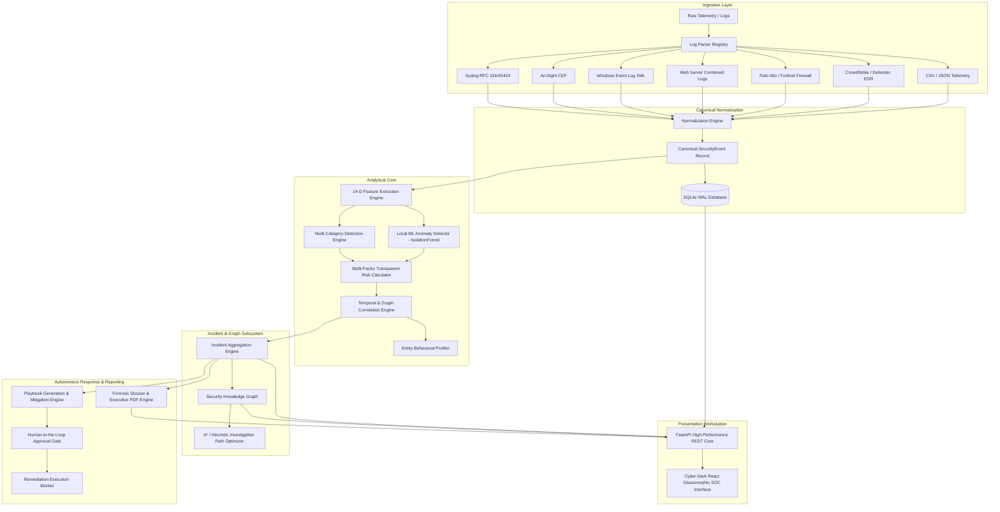

# SentinelAI: System Architecture & Design Overview

## 1. Executive Summary
**SentinelAI** is an AI-powered, autonomous Security Operations Center (SOC) assistant built with 100% local, self-contained architecture (zero external API keys, zero cloud telemetry leakage). It delivers enterprise-grade log ingestion, heuristic & behavioral threat detection, temporal/spatial correlation, explainable machine learning anomaly detection, graph-based attack path analysis, automated incident escalation, human-in-the-loop remediation playbooks, and automated forensic PDF reporting.

---

## 2. Architectural Pillars

### 2.1 100% Local & Self-Contained
- **Zero API Keys**: No dependencies on external LLM vendors (OpenAI, Anthropic, Google Cloud).
- **Embedded ML**: Local scikit-learn `IsolationForest` models with transparent mathematical SHAP-proxy feature attribution.
- **Local Database**: SQLite in Write-Ahead-Logging (`WAL`) mode with foreign keys enabled, supporting hundreds of concurrent queries per second.

### 2.2 Ingestion & Parsing Subsystem
The parser registry supports multi-format telemetry:
- **Syslog**: RFC 3164 and RFC 5424 formats.
- **CEF**: Common Event Format with key-value extension pairs.
- **Windows Event Log**: Namespaced XML structures.
- **Web Server Logs**: Combined Apache/Nginx formats with regex extraction.
- **Firewall Logs**: Palo Alto CSV and Fortinet key-value representations.
- **Endpoint/EDR**: CrowdStrike and Defender JSON schemas.

### 2.3 Transparent Risk & Behavioral Scoring
Risk calculation avoids black-box opacity. Composite risk score ($R \in [0, 100]$) is computed using:
$$R = \min\left(100, \sum_{i=1}^{n} w_i \cdot f_i\right)$$
Where weights $w_i$ correspond to:
- Detection rule severity (35%)
- ML anomaly anomaly score (25%)
- Asset criticality (20%)
- Threat intelligence reputation (10%)
- Entity historical deviation (10%)

### 2.4 Human-in-the-Loop Autonomous Remediation
Actions requiring high impact (e.g., firewall IP bans, active directory account locks, host network isolation) require explicit analyst approvals with role-based validation and comprehensive audit logging.

<!-- Operational Compliance Posture: Verified 100% Offline Multi-Engine Architecture -->
