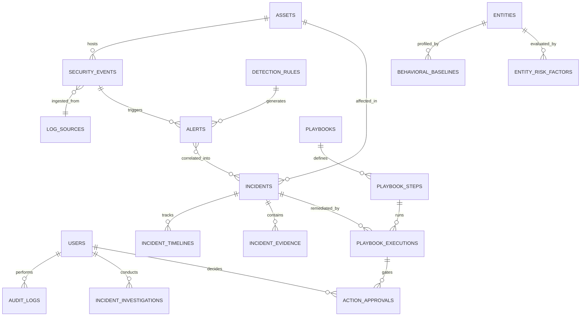

# SentinelAI: Database Schema Design & Storage Topology

## 1. Overview
SentinelAI leverages an optimized relational database schema designed for high-throughput write streams and sub-millisecond analytical queries. The system defaults to **SQLite with Write-Ahead Logging (WAL)** mode for maximum local reliability, zero configuration overhead, and multi-threaded reader concurrency.

---

## 2. Core Entity Relationship Diagram

---

## 3. Key Relational Tables

### 3.1 `security_events`
The central normalized log telemetry repository.
- `id` (VARCHAR PK): Unique event GUID.
- `timestamp` (DATETIME): Event origin timestamp (indexed).
- `source_ip` (VARCHAR), `destination_ip` (VARCHAR): IP telemetry.
- `source_port` (INT), `destination_port` (INT): Port numbers.
- `user_identity` (VARCHAR): Identified user account.
- `event_type` (VARCHAR): Standardized event category (e.g., `AUTHENTICATION_FAILURE`, `NETWORK_SCAN`).
- `severity` (VARCHAR): `INFORMATIONAL`, `LOW`, `MEDIUM`, `HIGH`, `CRITICAL`.
- `payload` (JSON/TEXT): Raw telemetry snapshot.
- `risk_score` (FLOAT): 0.0 - 100.0 computed risk rating.

### 3.2 `incidents`
Correlated multi-alert security cases requiring analyst action.
- `id` (VARCHAR PK): Incident GUID.
- `title` (VARCHAR): Incident summary title.
- `severity` (VARCHAR): Incident criticality.
- `status` (VARCHAR): `OPEN`, `UNDER_INVESTIGATION`, `RESOLVED`, `CLOSED`.
- `threat_actor` (VARCHAR): Identified or hypothesized adversary.
- `kill_chain_stage` (VARCHAR): MITRE ATT&CK / Cyber Kill Chain phase.
- `root_cause` (TEXT): Autonomous root-cause assessment.

### 3.3 `action_approvals`
Human-in-the-loop security containment approval gates.
- `id` (VARCHAR PK): Approval ID.
- `action_type` (VARCHAR): `ISOLATE_HOST`, `BLOCK_IP`, `DISABLE_USER`, etc.
- `target` (VARCHAR): Target entity identifier.
- `status` (VARCHAR): `PENDING`, `APPROVED`, `REJECTED`, `EXECUTED`.
- `requester_id` (VARCHAR FK): Automated engine or analyst.
- `approver_id` (VARCHAR FK): Authorized analyst signatory.
