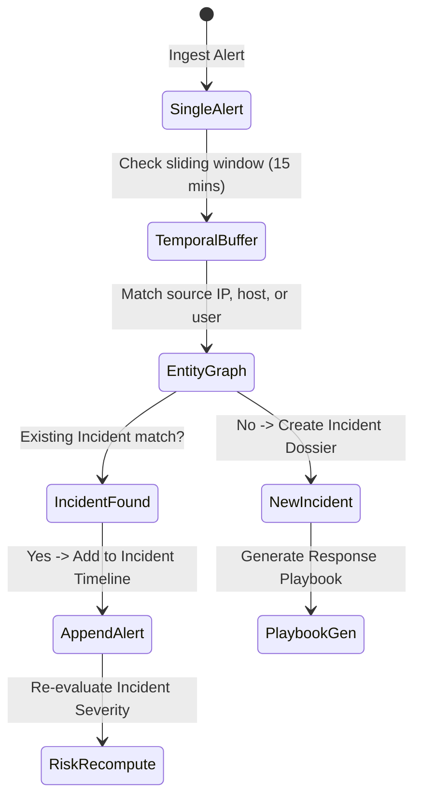

# SentinelAI: Detection Rules & Correlation Engine Guide

## 1. Multi-Tier Detection Engine
SentinelAI evaluates inbound canonical security events against a multi-layered rule pipeline spanning 10 core threat categories:

1. **Brute Force & Credential Stuffing**: Threshold triggers upon detecting $\ge 5$ authentication failures within 60 seconds.
2. **Port Scan & Network Reconnaissance**: Detection of $\ge 15$ distinct destination ports probed within a 30-second window.
3. **Privilege Escalation**: Unauthorized execution of `sudo`, `setuid`, or `RunAs` by non-administrative service accounts.
4. **Data Exfiltration**: Outbound traffic volume exceeding baseline by $> 300\%$ over high-risk network ports.
5. **Malware & C2 Beaconing**: Periodic heartbeat connections matching known threat intelligence IOCs or constant-interval entropy.
6. **SQL Injection & Web Attacks**: Parameter inspection for SQL syntax (`' OR '1'='1`, `UNION SELECT`), XSS payloads, or traversal sequences.
7. **Lateral Movement**: Pass-the-hash, PsExec, or anomalous SMB / WMI traffic between internal workstation segments.
8. **Anomalous After-Hours Access**: Authentication and sensitive resource access between 23:00 and 05:00 local time.
9. **Ransomware Indicators**: High-velocity file renaming or mass deletion events within endpoint telemetry.
10. **Defense Evasion**: Disabling of Windows Defender, Sysmon, or clearing of Windows Security Event Logs (`EventID 1102`).

---

## 2. Correlation Engine Mechanics
The correlation engine aggregates isolated alerts into unified security incidents:

